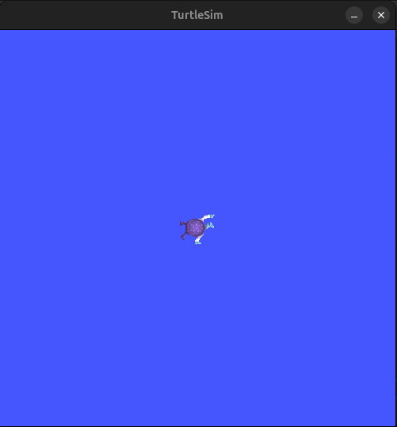
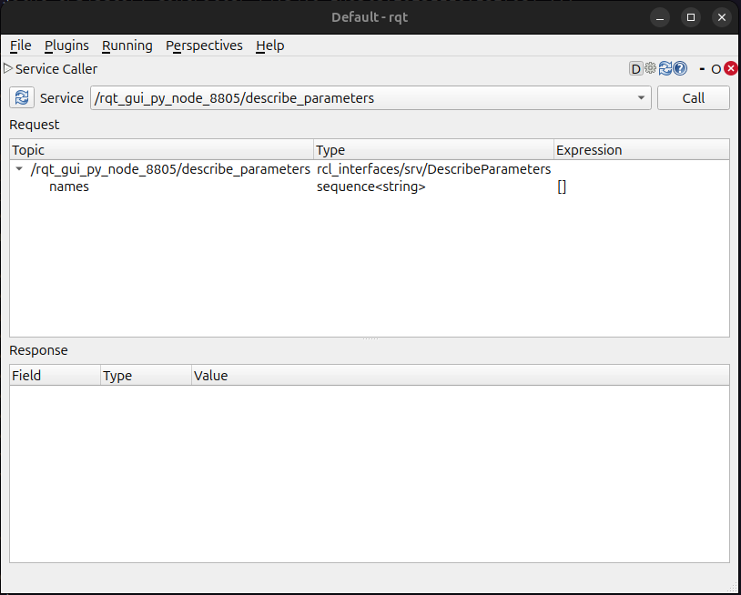
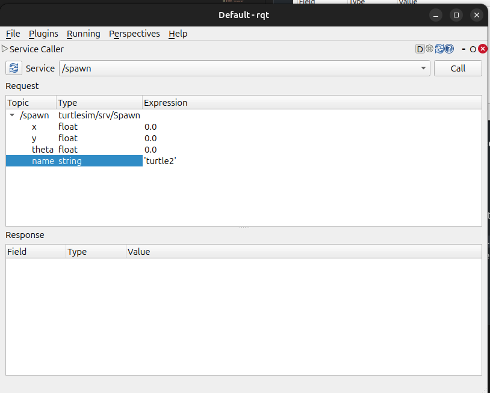

# Week 0: Understanding the Mark-1 Core Systems  
*Stark Cave Protocol - Neural Framework Primer*

Before Tony Stark could swing a hammer, weld armor plates, or fire up a prototype thruster, he needed to understand one thing:

**How the machine thinks.**

This week is exactly that.  
You’re not building metal yet - you’re building **the nervous system** of the Mark-1.  
The data pathways.  
The reflex loops.  
The internal communication grid that lets every subsystem talk.

In Stark terms:  
**This is where you study the brain that will run the suit.**

---
# ⚙️ Configuring StarkOS Environment

Before the Mark-1 can respond, obey, or calculate anything, the cave terminal must be wired with the correct environment settings - just like Tony rerouting power through salvaged circuits.

---

## Step 1: Source the Core ROS2 Setup files
Every new terminal needs to load the Mark-1 system logic.

```bash
source /opt/ros/jazzy/setup.bash
```
To automatically initialize ROS in future terminals, add this line to your shell configuration:

`Note: Tony never repeats a command he can automate; the suit should always wake up ready.`
```bash
echo "source /opt/ros/jazzy/setup.bash" >> ~/.bashrc
```
`This ensures ROS boots with every terminal - the same way Mark-1 core systems initialize the moment the suit powers on.`

## Step 2: Verifying System Diagnostics
When Tony powers a new subsystem, he checks readings, voltages, and signals.
You’ll do the same with ROS environment variables
```bash
printenv | grep -i ROS
```
Check that the variables like `ROS_DISTRO` and `ROS_VERSION` are set.
```bash
ROS_VERSION=2
ROS_PYTHON_VERSION=3
ROS_DISTRO=jazzy
```
If these variables are not set correctly, which means something didn’t snap into place. Reinstall ROS - the Mark-1 doesn’t run on half-connected systems.

## Step 3: Assigning Domain ID
This is your Mark-1 frequency channel -
the identifier that prevents your system from interfering with other ROS devices around you.
Set the `domain ID`. For more information go [here](https://docs.ros.org/en/jazzy/Concepts/Intermediate/About-Domain-ID.html).
Set the domain ID between **0 and 101**.

```bash
echo "export ROS_DOMAIN_ID=<your_domain_id>" >> ~/.bashrc
```

# Using `turtlesim`, `ros2`, and `rqt`
Before piloting a jet-powered exosuit, Tony practiced with tiny subsystems.

`turtlesim` is your equivalent - a cute little robot to help you understand movement, commands, topics, and behavior.

`rqt` is your holographic UI -
a mini version of the Iron Man HUD for viewing and calling ROS functionality.

## Task 1
Installing turtlesim
```bash
sudo apt update
sudo apt install ros-jazzy-turtlesim
```

To check if the package is installed, run the following command:
```bash
ros2 pkg executables turtlesim
```
It should output:
```bash
turtlesim draw_square
turtlesim mimic
turtlesim turtle_teleop_key
turtlesim turtlesim_node
```

## Task 2
Running turtlesim
```bash
ros2 run turtlesim turtlesim_node
```

It will open a window:


Open a new terminal and run:
```bash
ros2 run turtlesim turtle_teleop_key
```

You will be able to move your turtle now through the terminal!!

This confirms that StarkOS can successfully issue movement commands — your first proof that the system can control something in the real (or simulated) world.

## Task 3: Activating StarkOS HUD (`rqt`)

Open a new terminal to install `rqt` and its plugins:
```bash
sudo apt update
sudo apt install '~nros-jazzy-rqt*'
```
To run `rqt` just run:
```bash
rqt
```

When running `rqt` for the first time, It will start blank, just like Tony’s first cave HUD. Just select **Plugins > Services > Service Caller** from the menu bar on top.

> Note: It may take some time for rqt to locate all the plugins. If you click on Plugins but don’t see Services or any other options, you should close rqt and enter the command `rqt --force-discover` in your terminal.



Use the refresh button to the left of the **Service** dropdown list to ensure all the services of your turtlesim node are visible.
These are your low-level control ports — the suit’s equivalent of servo commands and actuator pings.

### Try the spawn service
Click on the **Service** dropdown and and select the `/spawn` service.



Give the new turtle a unique name, like `turtle2`, by double-clicking between the empty single quotes in the Expression column. You can see that this expression corresponds to the value of name and is of type string.

Next enter some valid coordinates at which to spawn the new turtle, like `x = 1.0` and `y = 1.0`.

> Note: If you try to spawn a new turtle with the same name as an existing turtle, like the default turtle1, you will get an error message in the terminal running turtlesim_node
> `[ERROR] [turtlesim]: A turtle named [turtle1] already exists`

`Using two components with the same ID in the Mark-1 results in faults.`
If you're successful, you should see a new turtle spawn in your existing window!!!

### Remapping controls
You need a second teleop node in order to control `turtle2`. However, if you try to run the same command as before, you will notice that this one also controls `turtle1`. The way to change this behavior is by remapping the `cmd_vel` topic.

In a new terminal, run:
```bash
ros2 run turtlesim turtle_teleop_key --ros-args --remap turtle1/cmd_vel:=turtle2/cmd_vel
```
Now you can move `turtle2` in this terminal!!

---

This is it for the initial part of this ROS2 bootcamp. Stay tuned for next [Week 1: The Birth of StarkOS Intelligence](../Week1/)
